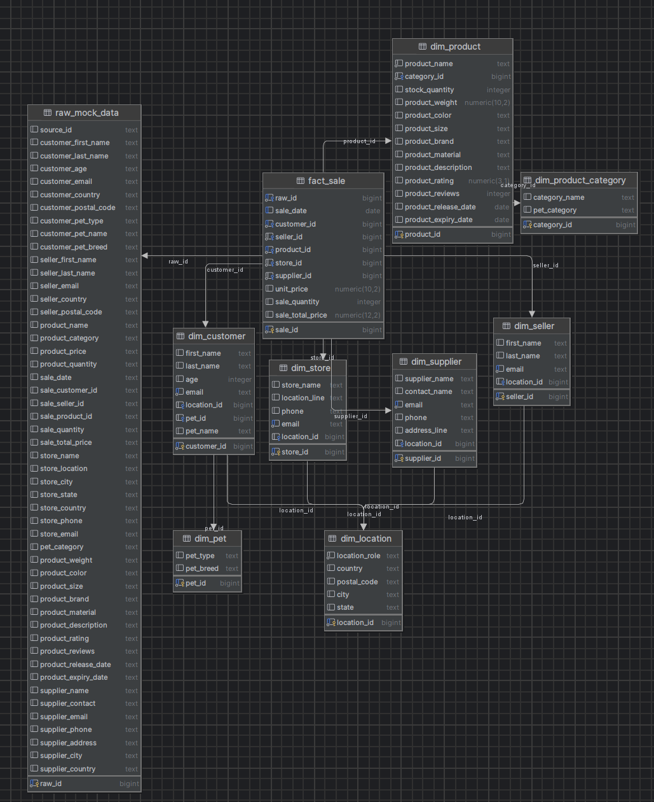

# BigDataSnowflake

Лабораторная работа №1 по анализу больших данных. В проекте исходные CSV-файлы загружаются в PostgreSQL и преобразуются в схему "снежинка".

Выполнил: Агафонов Андрей Сергеевич, группа М8О-315Б-23.

## Что есть в репозитории

- `docker-compose.yml` - поднимает PostgreSQL и автоматически выполняет SQL-скрипты из папки `sql`.
- `исходные данные/` - 10 исходных CSV-файлов по 1000 строк.
- `sql/01_create_raw_table.sql` - создаёт сырьевую таблицу `raw_mock_data`.
- `sql/02_load_raw_data.sql` - загружает все CSV в `raw_mock_data`.
- `sql/03_create_snowflake_tables.sql` - создаёт представление с очищенными данными и таблицы схемы "снежинка".
- `sql/04_fill_snowflake_tables.sql` - заполняет измерения и таблицу фактов.
- `sql/05_checks.sql` - проверочные запросы по итоговым таблицам.
- `report.md` - отчёт по лабораторной работе.
- `docs/lab1-schema.png` - схема итоговой модели.

## Быстрый запуск

1. Убедиться, что установлен Docker Desktop или Docker Engine с `docker compose`.
2. Из корня репозитория выполнить:

```bash
docker compose up -d
```

3. Проверить, что контейнер перешёл в состояние `healthy`:

```bash
docker compose ps
```

4. Подключиться к базе данных любым SQL-клиентом, например DBeaver.

Параметры подключения:

- host: `localhost`
- port: `5432`
- database: `bdsnowflake`
- user: `postgres`
- password: `postgres`

После первого запуска PostgreSQL сам последовательно выполнит все файлы из папки `sql`, поэтому отдельно руками загружать CSV не нужно.

Первый полный прогон занимает примерно 1.5-2 минуты, потому что контейнер не только поднимает PostgreSQL, но и сразу выполняет весь ETL.

## Какие скрипты используются

Скрипты уже подключены в `docker-compose.yml` и запускаются автоматически, но при необходимости их можно выполнить вручную в таком порядке:

1. `sql/01_create_raw_table.sql`
2. `sql/02_load_raw_data.sql`
3. `sql/03_create_snowflake_tables.sql`
4. `sql/04_fill_snowflake_tables.sql`
5. `sql/05_checks.sql`

Важно: ручной запуск тоже нужно делать против контейнера из `docker-compose.yml`, потому что CSV-файлы внутри PostgreSQL доступны по пути `/data`.

## Как проверить результат

Простейшая проверка из терминала:

```bash
docker exec -it bdsnowflake-postgres psql -U postgres -d bdsnowflake -f /docker-entrypoint-initdb.d/05_checks.sql
```

Если нужен только быстрый контроль количества продаж:

```bash
docker exec -it bdsnowflake-postgres psql -U postgres -d bdsnowflake -c "select count(*) from fact_sale;"
```

## Как перезапустить лабораторную с нуля

Инициализационные SQL-файлы в образе PostgreSQL выполняются только на пустом каталоге данных. Поэтому для полного повторного прогона нужно удалить volume:

```bash
docker compose down -v
docker compose up -d
```

## Что получается в базе

В решении используются такие таблицы:

- `raw_mock_data` - сырьевая таблица со строками из CSV.
- `dim_location` - справочник локаций с признаком источника (`customer`, `seller`, `store`, `supplier`).
- `dim_pet` - тип и порода питомца покупателя.
- `dim_product_category` - категория товара и категория питомца.
- `dim_customer` - покупатели.
- `dim_seller` - продавцы.
- `dim_store` - магазины.
- `dim_supplier` - поставщики.
- `dim_product` - товары.
- `fact_sale` - факты продаж.

## Результат проверки

После `docker compose up -d` и выполнения `sql/05_checks.sql` получаются такие количества:

- `raw_mock_data` - `10000`
- `dim_location` - `28083`
- `dim_pet` - `9`
- `dim_product_category` - `15`
- `dim_customer` - `10000`
- `dim_seller` - `10000`
- `dim_store` - `10000`
- `dim_supplier` - `10000`
- `dim_product` - `10000`
- `fact_sale` - `10000`

Пример итоговой аналитики из проверочного скрипта:

- `Birds` - `2070` продаж, `534985.37` выручки
- `Dogs` - `2056` продаж, `511599.84` выручки
- `Fish` - `2025` продаж, `510757.04` выручки
- `Reptiles` - `1942` продаж, `491329.75` выручки
- `Cats` - `1907` продаж, `481180.12` выручки

## Итоговая схема


